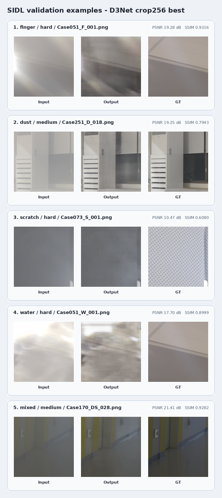
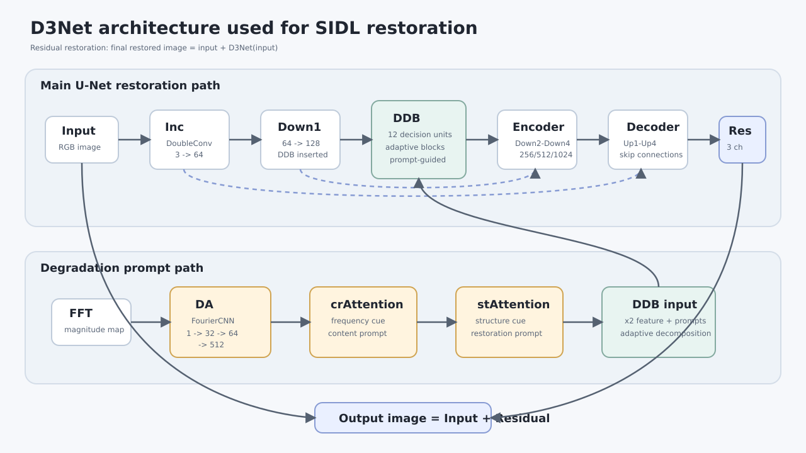
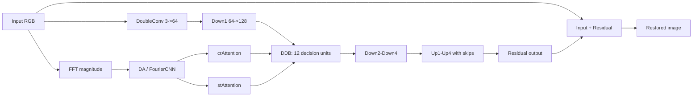

# SIDL D3Net Experiment Summary

작성일: 2026-06-07  
기준 데이터: `D3Net/data/SIDL/val`  
평가 지표: PSNR / SSIM

## 1. 128 run best table

`sidl_finetune` 체크포인트 기준이다. 학습 crop은 README 기본 설정상 128, validation crop은 512로 기록되어 있다.

| Run | Checkpoint | Best epoch | PSNR (dB) | SSIM | Notes |
|---|---:|---:|---:|---:|---|
| 128 crop baseline | `ckpt/sidl_finetune/generator_best.pth` | 34 | 23.33 | 0.8357 | `generator_latest.pth`는 epoch 49 |

Validation-only로 `generator_best.pth`를 재평가한 breakdown은 다음과 같다.

| Difficulty | Clean | Dust | Finger | Mixed | Scratch | Water | Average |
|---|---:|---:|---:|---:|---:|---:|---:|
| Easy | 32.70 / 0.9478 | 25.35 / 0.8839 | 24.40 / 0.8173 | 22.59 / 0.8425 | 27.69 / 0.8882 | 26.70 / 0.9176 | 26.57 / 0.8829 |
| Medium | 29.78 / 0.9369 | 22.95 / 0.8659 | 23.20 / 0.8392 | 22.64 / 0.8854 | 26.44 / 0.9022 | 23.78 / 0.8501 | 24.80 / 0.8799 |
| Hard | 26.77 / 0.8450 | 16.29 / 0.6980 | 19.56 / 0.7628 | 17.38 / 0.7770 | 19.46 / 0.7404 | 19.58 / 0.7905 | 19.84 / 0.7690 |
| Average | 29.31 / 0.9069 | 21.34 / 0.8125 | 21.44 / 0.7928 | 20.17 / 0.8205 | 24.37 / 0.8414 | 22.54 / 0.8364 | 23.33 / 0.8357 |

## 2. 256 run best table

`sidl_scratch_4090_crop256` 체크포인트 기준이다. 요청한 값과 동일하게 best epoch는 34, PSNR은 23.82 dB이다.

| Run | Checkpoint | Best epoch | PSNR (dB) | SSIM | Notes |
|---|---:|---:|---:|---:|---|
| 256 crop scratch | `ckpt/sidl_scratch_4090_crop256/generator_best.pth` | 34 | 23.82 | 0.8398 | `generator_latest.pth`는 epoch 59 |

Validation-only로 `generator_best.pth`를 재평가한 breakdown은 다음과 같다.

| Difficulty | Clean | Dust | Finger | Mixed | Scratch | Water | Average |
|---|---:|---:|---:|---:|---:|---:|---:|
| Easy | 32.93 / 0.9514 | 25.76 / 0.8883 | 25.09 / 0.7823 | 23.01 / 0.8504 | 28.10 / 0.8939 | 27.08 / 0.9208 | 27.00 / 0.8812 |
| Medium | 30.52 / 0.9419 | 23.60 / 0.8757 | 23.73 / 0.8460 | 22.91 / 0.8871 | 27.30 / 0.9101 | 24.10 / 0.8564 | 25.36 / 0.8862 |
| Hard | 27.46 / 0.8491 | 16.86 / 0.7065 | 19.73 / 0.7597 | 17.62 / 0.7843 | 20.24 / 0.7490 | 20.06 / 0.7971 | 20.33 / 0.7743 |
| Average | 29.93 / 0.9113 | 21.89 / 0.8203 | 21.80 / 0.7858 | 20.48 / 0.8269 | 25.07 / 0.8488 | 22.93 / 0.8423 | 23.82 / 0.8398 |

## 3. 512 refinement 결과

`sidl_refine512_from256best_lr1e5` 폴더 기준이다. 별도 학습 로그 파일이 없어 전체 epoch trace는 복원할 수 없으며, checkpoint metadata와 validation-only 재평가 결과를 함께 기록했다.

| Run | Checkpoint | Epoch | PSNR (dB) | SSIM | Notes |
|---|---:|---:|---:|---:|---|
| 512 refinement from 256 best, LR 1e-5 | `ckpt/sidl_refine512_from256best_lr1e5/generator_best.pth` | 2 | 23.27 | 0.8336 | validation-only 재평가 |
| 512 refinement latest | `ckpt/sidl_refine512_from256best_lr1e5/generator_latest.pth` | 2 | - | - | latest checkpoint에는 metric field 없음 |

Validation-only breakdown은 다음과 같다.

| Difficulty | Clean | Dust | Finger | Mixed | Scratch | Water | Average |
|---|---:|---:|---:|---:|---:|---:|---:|
| Easy | 32.21 / 0.9470 | 24.96 / 0.8836 | 23.73 / 0.7750 | 23.05 / 0.8442 | 26.95 / 0.8878 | 26.44 / 0.9153 | 26.22 / 0.8755 |
| Medium | 28.36 / 0.9329 | 23.14 / 0.8656 | 23.18 / 0.8401 | 23.33 / 0.8858 | 26.97 / 0.9052 | 23.74 / 0.8503 | 24.79 / 0.8800 |
| Hard | 26.43 / 0.8421 | 16.63 / 0.7014 | 19.79 / 0.7550 | 17.34 / 0.7746 | 20.05 / 0.7428 | 20.01 / 0.7928 | 20.04 / 0.7681 |
| Average | 28.45 / 0.9039 | 21.41 / 0.8135 | 21.42 / 0.7803 | 20.44 / 0.8200 | 24.54 / 0.8431 | 22.65 / 0.8371 | 23.27 / 0.8336 |

## 4. Low-LR polishing 결과

확인된 low-LR polishing 결과는 `sidl_refine256_from256best_lr1e5` 폴더 기준이다. `generator_best.pth`를 validation-only로 재평가했다.

| Candidate | Status | Epoch | PSNR (dB) | SSIM | Notes |
|---|---|---:|---:|---:|---|
| `sidl_refine256_from256best_lr1e5` | available | 3 | 23.76 | 0.8409 | best checkpoint, validation-only 재평가 |
| `sidl_refine512_from256best_lr1e5` | available | 2 | 23.27 | 0.8336 | 512 refinement 결과 |
| `sidl_finetune_ft_step1` | auxiliary checkpoint | 1 | 23.16 | 0.8316 | auxiliary run |

Low-LR polishing validation-only breakdown은 다음과 같다.

| Difficulty | Clean | Dust | Finger | Mixed | Scratch | Water | Average |
|---|---:|---:|---:|---:|---:|---:|---:|
| Easy | 32.22 / 0.9512 | 24.84 / 0.8821 | 24.73 / 0.7952 | 23.07 / 0.8513 | 28.03 / 0.8978 | 26.35 / 0.9163 | 26.54 / 0.8823 |
| Medium | 30.37 / 0.9412 | 23.71 / 0.8759 | 23.33 / 0.8433 | 23.21 / 0.8892 | 27.17 / 0.9096 | 24.08 / 0.8571 | 25.31 / 0.8861 |
| Hard | 27.41 / 0.8491 | 17.05 / 0.7081 | 20.02 / 0.7671 | 18.08 / 0.7881 | 20.14 / 0.7473 | 20.17 / 0.7975 | 20.48 / 0.7762 |
| Average | 29.70 / 0.9110 | 21.72 / 0.8190 | 21.79 / 0.7918 | 20.77 / 0.8294 | 24.97 / 0.8493 | 22.85 / 0.8421 | 23.76 / 0.8409 |

## 5. Input / Output / GT examples

아래 이미지는 `sidl_scratch_4090_crop256/generator_best.pth`를 사용해 validation sample 5개를 추론한 비교 패널이다. CUDA가 없는 현재 환경 때문에 보고서용 예시는 CPU에서 512 center crop 추론 후 238 px tile로 표시했다.

| # | Type | Difficulty | File | Output PSNR (dB) | Output SSIM |
|---:|---|---|---|---:|---:|
| 1 | finger | hard | `Case051_F_001.png` | 19.28 | 0.9316 |
| 2 | dust | medium | `Case251_D_018.png` | 19.25 | 0.7943 |
| 3 | scratch | hard | `Case073_S_001.png` | 10.47 | 0.6080 |
| 4 | water | hard | `Case051_W_001.png` | 17.70 | 0.8999 |
| 5 | mixed | medium | `Case170_DS_028.png` | 21.41 | 0.9282 |

## 6. Model structure

구조 그림은 코드(`models/base_model.py`)를 기준으로 새로 정리했다.

핵심 흐름은 다음과 같다.

## Report notes

- Best 값은 각 `generator_best.pth` 내부의 `epoch`, `psnr`, `ssim` field에서 확인했다.
- run별 best table은 가능하면 checkpoint를 이용한 validation-only 재평가 결과를 위와 같은 type x difficulty breakdown 형식으로 제시한다.
- 전체 epoch별 validation 로그 파일은 저장되어 있지 않아, 512 refinement의 모든 epoch PSNR table은 현재 workspace만으로는 복원할 수 없다.
- 예시 이미지는 실제 모델 출력 기반이며, AI로 임의 생성한 restoration 결과는 포함하지 않았다.
